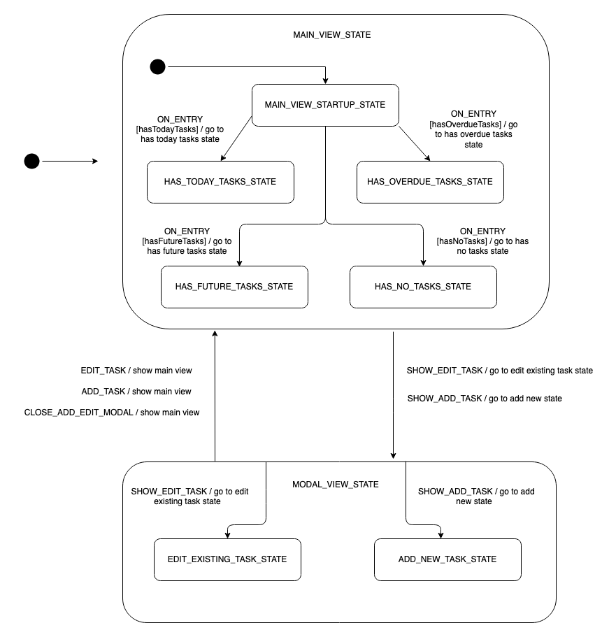
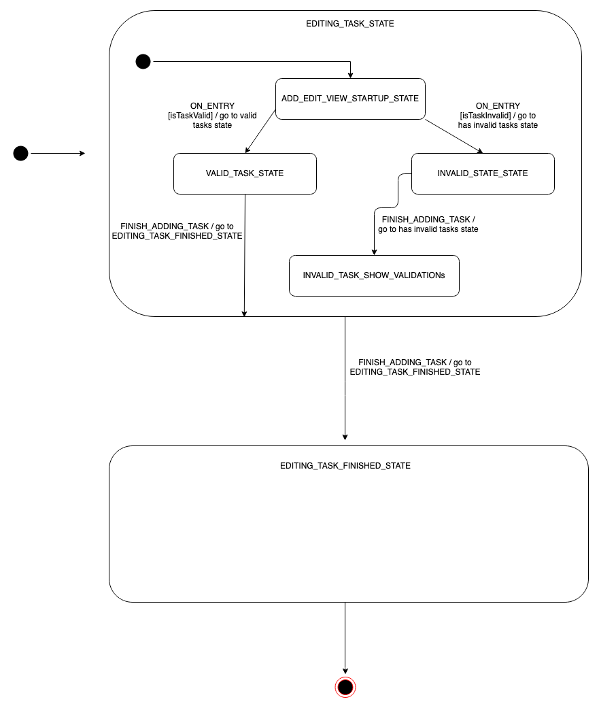

# Todos XState

A Todos app using xstate state machines.

# Description

The application relies on two state machines: the `TasksPageMachine`, which tracks the different states the application could be in while on the main Todos page. The other is the `AddEditViewMachine` machine, which tracks validation logic flow while inside either the add/edit Todo modal.

Uses React classes with XState

# Diagrams

The following two diagrams show on a high level how both xstate machines work:

TasksPageMachine: 


AddEditViewMachine: 



## Installation

```
$ yarn
```

## Running

```
$ yarn start

A window will automatically open, or you can navigate to `localhost:3000` to see the app.
```

## Build

```
$ yarn build
```

## Format code (using [Prettier](https://github.com/prettier/prettier))

```
$ yarn prettier
```

# License

MIT
